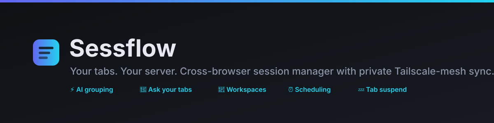

<p align="center">
  
</p>

<p align="center">
  <a href="https://github.com/devaprakashpro/sessflow/actions/workflows/ci.yml"></a>
  
  
  
  
</p>

# Sessflow 🗄️

A modern, cross-browser **session & tab manager** — everything Session Buddy does, plus **private sync to your own Tailscale node**, AI auto-grouping, ask-your-tabs search over an automatic page archive, workspaces, scheduled sessions, a command palette and a memory-saving tab suspender. Manifest V3, local-first.

> **The wedge:** unlike every competitor, Sessflow can sync to a server *you* run on your own machine over Tailscale — no third-party cloud, zero cost, fully private. See [`server/`](./server).

---

## Feature parity with Session Buddy
- **One-click save** of the current window or all windows into a named session (preserves multi-window layout, pinned tabs, and native tab-group titles).
- **Browse / search / edit / restore** sessions — whole session, single window, or a single tab.
- **Automatic crash recovery** — a rolling snapshot of all open windows is written every couple of minutes and promoted to a recoverable session on the next startup.
- **Export / import** — JSON, Markdown, HTML, CSV, plain-text. Import also reads plain URL lists and HTML bookmark dumps.
- **Duplicate-tab finder**.
- **Local-first** — sessions live in IndexedDB (no quota ceiling, works fully offline).

## What's added on top
- **🛰️ Mesh Sync (self-host over Tailscale)** — sync sessions to a tiny server *you* run on your tailnet. Real-time push via WebSocket, last-write-wins, no public IP/TLS needed. See [`server/`](./server).
- **🗃️ Automatic page archive** — the Mesh server fetches every saved URL, extracts readable text and stores it. Link-rot insurance + the index behind search.
- **🔮 Ask your tabs** — full-text (FTS5) search across all archived pages, and a Claude-powered RAG mode that answers questions over everything you've saved, with citations. *(Anthropic key lives on the server, never in the browser.)*
- **📁 Workspaces** — group sessions by project; filter the dashboard per workspace; pin favorites to the top.
- **⏰ Scheduled sessions** — auto-open a session at a set time on chosen weekdays (e.g. your "Work" set at 9am Mon–Fri). Plus optional auto-save-on-window-close.
- **✨ AI auto-grouping (Claude)** — clusters a session's tabs into named topics, suggests a session name + summary, writes topics back as tags. Domain-grouping fallback with no key.
- **☁️ Supabase cloud sync** — alternative hosted backend, last-write-wins, with **opt-in end-to-end encryption** (AES-GCM / PBKDF2 — the provider only stores ciphertext).
- **🔍 Command palette (⌘/Ctrl-K)** — fuzzy search across *every saved tab* and run quick actions instantly.
- **🏷️ Tags + fuzzy search** — tag sessions, filter by tag/kind/workspace, fuzzy-search names & summaries (Fuse.js).
- **💤 Tab suspension** — auto-suspend idle background tabs to free RAM (per-domain allowlist); refocus/click to restore.
- **🔗 Sharing** — copy any session as a shareable text/Markdown list.
- **Cross-browser** — one codebase, Chrome/Edge **and** Firefox MV3 builds.

## The Mesh server (your Tailscale node)
The differentiator. A self-hosted Node server (`server/`) that gives you private sync + archive + AI without any cloud:
```bash
cd server && npm install && npm start    # prints a device token
```
Then in the extension: **Settings → Cloud sync → Mesh**, paste the server URL (`http://your-machine.your-tailnet.ts.net:7777`) and the token. Full setup, API and systemd unit in [`server/README.md`](./server/README.md).

---

## Develop / build

```bash
npm install
npm run dev            # Vite dev server with HMR (Chrome)
npm run build          # → dist/         (Chrome / Edge)
npm run build:firefox  # → dist-firefox/ (Firefox MV3)
npm run zip            # build + zip dist/ for the Chrome Web Store
```

### Load the unpacked extension
- **Chrome / Edge:** `chrome://extensions` → enable *Developer mode* → *Load unpacked* → select `dist/`.
- **Firefox:** `about:debugging#/runtime/this-firefox` → *Load Temporary Add-on* → pick any file in `dist-firefox/`.

### Default keyboard shortcuts
| Shortcut | Action |
|---|---|
| `Ctrl/⌘ + Shift + S` | Save current window as a session |
| `Ctrl/⌘ + Shift + E` | Open dashboard |
| `Ctrl/⌘ + Shift + K` | Open command palette |
| `Alt + S` | Open the popup |

---

## Cloud sync setup (Supabase)

1. Create a Supabase project, then run this SQL:

```sql
create table public.sessions (
  id          text primary key,
  owner       uuid default auth.uid(),
  rev         int  not null,
  updated_at  bigint not null,
  deleted     boolean default false,
  payload     jsonb not null
);

alter table public.sessions enable row level security;

create policy "own rows" on public.sessions
  for all using (owner = auth.uid()) with check (owner = auth.uid());
```

2. In **Settings → Cloud sync**, pick *Supabase*, paste your project URL + anon key, sign in (email/password), and optionally set an **E2E passphrase** to encrypt payloads before upload.
3. Hit **Sync now**, or enable auto-sync (every 5 min).

> If sync requests are blocked by CORS in Firefox, add your Supabase origin to `host_permissions` in `src/manifests/manifest.ts` and rebuild.

---

## Architecture

```
src/
  manifests/manifest.ts   cross-browser MV3 manifest factory (SW vs scripts, gecko id)
  background/             service worker: crash snapshots, auto-save, alarms,
                          commands, context menus, suspension sweep, message router
  lib/
    db.ts                 Dexie (IndexedDB) schema — sessions/workspaces/schedules
    sessions.ts           capture / CRUD / restore / dedup
    search.ts             Fuse.js indexes (tab-level + session-level)
    ai.ts                 Claude grouping (tool-use) + domain fallback
    sync.ts               sync dispatcher (mesh | supabase)
    mesh.ts               self-host Mesh adapter + search/ask client
    crypto.ts             AES-GCM E2E encryption for Supabase payloads
    workspaces.ts         workspace CRUD + assignment
    schedules.ts          scheduled-session CRUD + due-time logic
    suspend.ts            tab suspension + sharing helpers
    exporter.ts           export/import (json/md/html/csv/text)
    settings.ts           settings store + change events
    messaging.ts          typed UI ↔ background bridge
  popup/                  React popup (quick save / restore / actions)
  dashboard/              React dashboard (browse, search, tags, workspaces,
                          command palette, Ask panel, settings)
  suspended/              lightweight placeholder page for suspended tabs

server/                   Mesh Sync server (Node ESM, no build step)
  src/index.js            Hono app + WebSocket live-push + bootstrap
  src/db.js               SQLite (sessions + pages) + FTS5 index
  src/archive.js          background page-fetch + readability extraction
  src/ai.js               FTS5 retrieval + Claude RAG (ask-your-tabs)
```

Data flows **local-first**: the UI reads IndexedDB live (`dexie-react-hooks`), writes mark rows `dirty`, and the sync layer mirrors dirty rows to the cloud and pulls remote changes. Nothing requires the network to function.

## Privacy
The Anthropic API key, Supabase keys and E2E passphrase live only in `browser.storage.local`. With an E2E passphrase set, synced session contents are encrypted on-device and never readable by the sync provider.
